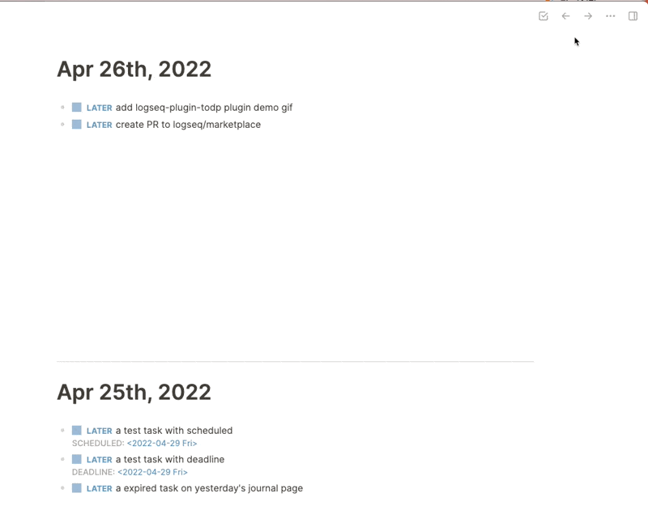

# Logseq Todo Plugin

A simple to-do list plugin for logseq

## Install

### Option 1: directly install via Marketplace

### Option 2: manually load

- turn on Logseq developer mode
- [download the prebuilt package here](https://github.com/ahonn/logseq-plugin-todo/releases)
- unzip the zip file and load from Logseq plugins page

## Page Properties

- `todo-ignore`: Whether to hide the todo task in the current page
