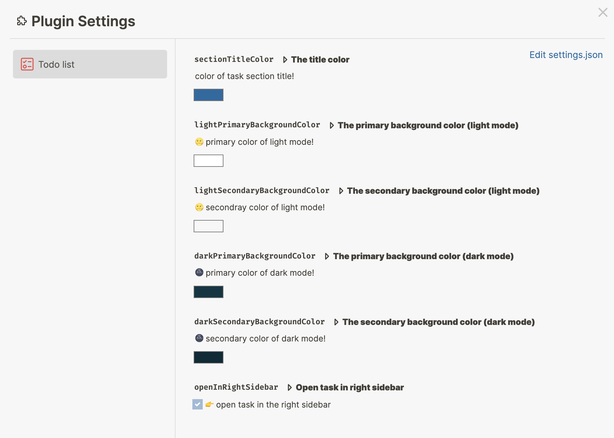

# Logseq Todo Plugin

A simple to-do list plugin for logseq

> This plugin relies solely on the Logseq Plugin API to access local data, and does not store it externally.

### Features
- Quickly add new to-do items to today's journal page.
- View all of today's to-do items (include scheduled & today's journal page).
- View all to-do items without a schedule.
- Ignore to-do items on a specified page.

## Install

### Option 1: directly install via Marketplace

### Option 2: manually load

- turn on Logseq developer mode
- [download the prebuilt package here](https://github.com/ahonn/logseq-plugin-todo/releases)
- unzip the zip file and load from Logseq plugins page

## Page Properties

- `todo-ignore`: Whether to hide the todo task in the current page. see [How to use todo-ignore #8](https://github.com/ahonn/logseq-plugin-todo/issues/8)

## Contribution
Issues and PRs are welcome!

## Licence
MIT
